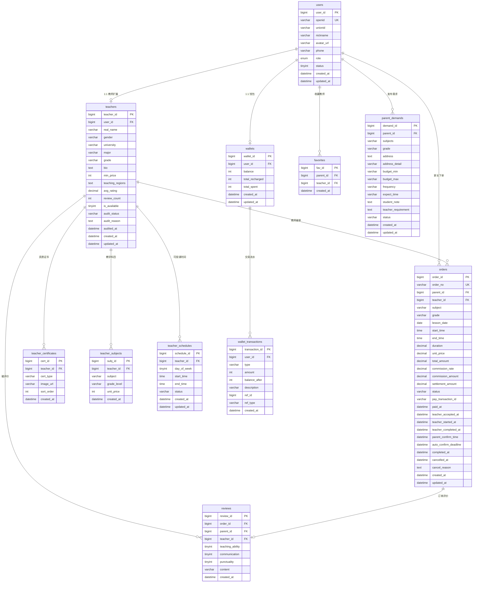

# 河大家教小程序 — 数据库设计文档

> **版本**: v1.0
> **日期**: 2026-05-23
> **作者**: 小C（后端开发工程师）
> **数据库**: MySQL 8.0
> **字符集**: utf8mb4 / utf8mb4_unicode_ci

---

## 一、ER 图



---

## 二、完整建表 SQL

```sql
-- ============================================================
-- 河大家教小程序 数据库建表脚本
-- MySQL 8.0 / utf8mb4
-- ============================================================

CREATE DATABASE IF NOT EXISTS `henu_tutor`
  DEFAULT CHARACTER SET utf8mb4
  COLLATE utf8mb4_unicode_ci;

USE `henu_tutor`;

-- -----------------------------------------------------------
-- 1. 用户表
-- -----------------------------------------------------------
CREATE TABLE `users` (
    `user_id`        BIGINT UNSIGNED  NOT NULL AUTO_INCREMENT COMMENT '用户ID',
    `openid`         VARCHAR(64)      NOT NULL COMMENT '微信OpenID',
    `unionid`        VARCHAR(64)      DEFAULT NULL COMMENT '微信UnionID',
    `nickname`       VARCHAR(64)      NOT NULL COMMENT '微信昵称',
    `avatar_url`     VARCHAR(512)     DEFAULT NULL COMMENT '微信头像URL',
    `phone`          VARCHAR(11)      DEFAULT NULL COMMENT '绑定手机号',
    `role`           ENUM('parent','teacher','admin') 
                                      NOT NULL COMMENT '角色: parent=家长, teacher=教师, admin=管理员',
    `status`         TINYINT          NOT NULL DEFAULT 1 COMMENT '状态: 1=正常, 0=禁用',
    `created_at`     DATETIME         NOT NULL DEFAULT CURRENT_TIMESTAMP COMMENT '注册时间',
    `updated_at`     DATETIME         NOT NULL DEFAULT CURRENT_TIMESTAMP ON UPDATE CURRENT_TIMESTAMP COMMENT '更新时间',
    PRIMARY KEY (`user_id`),
    UNIQUE KEY `uk_openid` (`openid`),
    KEY `idx_role` (`role`),
    KEY `idx_phone` (`phone`),
    KEY `idx_status` (`status`),
    KEY `idx_created_at` (`created_at`)
) ENGINE=InnoDB DEFAULT CHARSET=utf8mb4 COLLATE=utf8mb4_unicode_ci COMMENT='用户表';


-- -----------------------------------------------------------
-- 2. 教师扩展信息表
-- -----------------------------------------------------------
CREATE TABLE `teachers` (
    `teacher_id`       BIGINT UNSIGNED  NOT NULL AUTO_INCREMENT COMMENT '教师ID',
    `user_id`          BIGINT UNSIGNED  NOT NULL COMMENT '关联用户ID',
    `real_name`        VARCHAR(32)      NOT NULL COMMENT '真实姓名',
    `gender`           ENUM('male','female') NOT NULL COMMENT '性别',
    `university`       VARCHAR(64)      NOT NULL DEFAULT '河南大学' COMMENT '学校',
    `major`            VARCHAR(64)      NOT NULL COMMENT '专业',
    `grade`            VARCHAR(16)      NOT NULL COMMENT '年级: 大一/大二/大三/大四/研一/研二/研三',
    `bio`              TEXT             DEFAULT NULL COMMENT '个人简介(200字以内)',
    `min_price`        INT              NOT NULL DEFAULT 0 COMMENT '最低课时费(元/小时), MVP统一价',
    `teaching_regions` VARCHAR(512)     DEFAULT NULL COMMENT '可授课区域, JSON数组',
    `avg_rating`       DECIMAL(3,2)     NOT NULL DEFAULT 0.00 COMMENT '平均评分',
    `review_count`     INT UNSIGNED     NOT NULL DEFAULT 0 COMMENT '评价总数',
    `is_available`     TINYINT          NOT NULL DEFAULT 1 COMMENT '当前是否可预约: 1=可预约, 0=不可',
    `audit_status`     ENUM('pending','approved','rejected')
                                        NOT NULL DEFAULT 'pending' COMMENT '审核状态: pending=待审核, approved=已通过, rejected=已驳回',
    `audit_reason`     TEXT             DEFAULT NULL COMMENT '审核原因(驳回时填写)',
    `audited_at`       DATETIME         DEFAULT NULL COMMENT '审核时间',
    `created_at`       DATETIME         NOT NULL DEFAULT CURRENT_TIMESTAMP COMMENT '申请时间',
    `updated_at`       DATETIME         NOT NULL DEFAULT CURRENT_TIMESTAMP ON UPDATE CURRENT_TIMESTAMP COMMENT '更新时间',
    PRIMARY KEY (`teacher_id`),
    UNIQUE KEY `uk_user_id` (`user_id`),
    KEY `idx_audit_status` (`audit_status`),
    KEY `idx_university` (`university`),
    KEY `idx_avg_rating` (`avg_rating`),
    KEY `idx_review_count` (`review_count`),
    KEY `idx_is_available` (`is_available`),
    CONSTRAINT `fk_teachers_user` FOREIGN KEY (`user_id`) REFERENCES `users` (`user_id`) ON DELETE CASCADE
) ENGINE=InnoDB DEFAULT CHARSET=utf8mb4 COLLATE=utf8mb4_unicode_ci COMMENT='教师扩展信息表';


-- -----------------------------------------------------------
-- 3. 教师资质证书表
-- -----------------------------------------------------------
CREATE TABLE `teacher_certificates` (
    `cert_id`    BIGINT UNSIGNED  NOT NULL AUTO_INCREMENT COMMENT '证书ID',
    `teacher_id` BIGINT UNSIGNED  NOT NULL COMMENT '关联教师ID',
    `cert_type`  VARCHAR(32)      NOT NULL COMMENT '证书类型: student_card=学生证, other=其他证书',
    `image_url`  VARCHAR(512)     NOT NULL COMMENT '证书图片URL',
    `sort_order` INT              NOT NULL DEFAULT 0 COMMENT '排序',
    `created_at` DATETIME         NOT NULL DEFAULT CURRENT_TIMESTAMP COMMENT '创建时间',
    PRIMARY KEY (`cert_id`),
    KEY `idx_teacher_id` (`teacher_id`),
    CONSTRAINT `fk_certificates_teacher` FOREIGN KEY (`teacher_id`) REFERENCES `teachers` (`teacher_id`) ON DELETE CASCADE
) ENGINE=InnoDB DEFAULT CHARSET=utf8mb4 COLLATE=utf8mb4_unicode_ci COMMENT='教师资质证书表';


-- -----------------------------------------------------------
-- 4. 教师教学科目表
-- -----------------------------------------------------------
CREATE TABLE `teacher_subjects` (
    `subj_id`     BIGINT UNSIGNED  NOT NULL AUTO_INCREMENT COMMENT '科目关联ID',
    `teacher_id`  BIGINT UNSIGNED  NOT NULL COMMENT '关联教师ID',
    `subject`     VARCHAR(32)      NOT NULL COMMENT '教学科目: math/english/physics/chemistry/chinese/biology/history/geography/politics/other',
    `grade_level` VARCHAR(32)      NOT NULL COMMENT '教学年级: primary_1~6 / junior_1~3 / senior_1~3',
    `unit_price`  INT              NOT NULL DEFAULT 0 COMMENT '该科目课时费(元/小时), 0表示使用min_price',
    `created_at`  DATETIME         NOT NULL DEFAULT CURRENT_TIMESTAMP COMMENT '创建时间',
    PRIMARY KEY (`subj_id`),
    UNIQUE KEY `uk_teacher_subject_grade` (`teacher_id`, `subject`, `grade_level`),
    KEY `idx_teacher_id` (`teacher_id`),
    KEY `idx_subject` (`subject`),
    KEY `idx_grade_level` (`grade_level`),
    CONSTRAINT `fk_subjects_teacher` FOREIGN KEY (`teacher_id`) REFERENCES `teachers` (`teacher_id`) ON DELETE CASCADE
) ENGINE=InnoDB DEFAULT CHARSET=utf8mb4 COLLATE=utf8mb4_unicode_ci COMMENT='教师教学科目表';


-- -----------------------------------------------------------
-- 5. 教师可授课时间表
-- -----------------------------------------------------------
CREATE TABLE `teacher_schedules` (
    `schedule_id`  BIGINT UNSIGNED  NOT NULL AUTO_INCREMENT COMMENT '排课ID',
    `teacher_id`   BIGINT UNSIGNED  NOT NULL COMMENT '关联教师ID',
    `day_of_week`  TINYINT          NOT NULL COMMENT '星期: 1=周一, 7=周日',
    `start_time`   TIME             NOT NULL COMMENT '开始时间(含日期,仅存时间部分)',
    `end_time`     TIME             NOT NULL COMMENT '结束时间',
    `status`       ENUM('available','occupied','blocked')
                                    NOT NULL DEFAULT 'available' COMMENT '状态: available=可约, occupied=已约, blocked=临时关闭',
    `created_at`   DATETIME         NOT NULL DEFAULT CURRENT_TIMESTAMP COMMENT '创建时间',
    `updated_at`   DATETIME         NOT NULL DEFAULT CURRENT_TIMESTAMP ON UPDATE CURRENT_TIMESTAMP COMMENT '更新时间',
    PRIMARY KEY (`schedule_id`),
    KEY `idx_teacher_day` (`teacher_id`, `day_of_week`),
    KEY `idx_status` (`status`),
    CONSTRAINT `fk_schedules_teacher` FOREIGN KEY (`teacher_id`) REFERENCES `teachers` (`teacher_id`) ON DELETE CASCADE
) ENGINE=InnoDB DEFAULT CHARSET=utf8mb4 COLLATE=utf8mb4_unicode_ci COMMENT='教师可授课时间表';


-- -----------------------------------------------------------
-- 6. 订单表
-- -----------------------------------------------------------
CREATE TABLE `orders` (
    `order_id`               BIGINT UNSIGNED  NOT NULL AUTO_INCREMENT COMMENT '订单ID',
    `order_no`               VARCHAR(32)      NOT NULL COMMENT '订单编号(唯一): 格式 HD20260523XXXXX',
    `parent_id`              BIGINT UNSIGNED  NOT NULL COMMENT '家长用户ID',
    `teacher_id`             BIGINT UNSIGNED  NOT NULL COMMENT '教师用户ID(关联teachers表)',
    `subject`                VARCHAR(32)      NOT NULL COMMENT '科目',
    `grade`                  VARCHAR(32)      NOT NULL COMMENT '年级',
    `lesson_date`            DATE             NOT NULL COMMENT '上课日期',
    `start_time`             TIME             NOT NULL COMMENT '开始时间',
    `end_time`               TIME             NOT NULL COMMENT '结束时间',
    `duration`               DECIMAL(4,1)     NOT NULL COMMENT '课时长度(小时)',
    `unit_price`             DECIMAL(10,2)    NOT NULL COMMENT '单价(元/小时)',
    `total_amount`           DECIMAL(10,2)    NOT NULL COMMENT '订单总金额(元)',
    `commission_rate`        DECIMAL(5,3)     NOT NULL DEFAULT 0.150 COMMENT '佣金比例(如0.150=15%)',
    `commission_amount`      DECIMAL(10,2)    NOT NULL DEFAULT 0.00 COMMENT '佣金金额(元)',
    `settlement_amount`      DECIMAL(10,2)    NOT NULL DEFAULT 0.00 COMMENT '教师结算金额(元)',
    `status`                 VARCHAR(32)      NOT NULL DEFAULT 'pending_confirm' COMMENT '订单状态',
    `pay_transaction_id`     VARCHAR(64)      DEFAULT NULL COMMENT '微信支付流水号',
    `paid_at`                DATETIME         DEFAULT NULL COMMENT '支付时间',
    `teacher_accepted_at`    DATETIME         DEFAULT NULL COMMENT '教师确认接单时间',
    `teacher_started_at`     DATETIME         DEFAULT NULL COMMENT '教师标记上课时间',
    `teacher_completed_at`   DATETIME         DEFAULT NULL COMMENT '教师标记完成时间',
    `parent_confirm_time`    DATETIME         DEFAULT NULL COMMENT '家长确认时间',
    `auto_confirm_deadline`  DATETIME         DEFAULT NULL COMMENT '自动确认截止时间(教师标记完成后48h)',
    `completed_at`           DATETIME         DEFAULT NULL COMMENT '订单完成时间',
    `cancelled_at`           DATETIME         DEFAULT NULL COMMENT '订单取消时间',
    `cancel_reason`          TEXT             DEFAULT NULL COMMENT '取消/退款原因',
    `created_at`             DATETIME         NOT NULL DEFAULT CURRENT_TIMESTAMP COMMENT '创建时间',
    `updated_at`             DATETIME         NOT NULL DEFAULT CURRENT_TIMESTAMP ON UPDATE CURRENT_TIMESTAMP COMMENT '更新时间',
    PRIMARY KEY (`order_id`),
    UNIQUE KEY `uk_order_no` (`order_no`),
    KEY `idx_parent_id` (`parent_id`),
    KEY `idx_teacher_id` (`teacher_id`),
    KEY `idx_status` (`status`),
    KEY `idx_lesson_date` (`lesson_date`),
    KEY `idx_created_at` (`created_at`),
    KEY `idx_parent_status` (`parent_id`, `status`),
    KEY `idx_teacher_status` (`teacher_id`, `status`),
    CONSTRAINT `fk_orders_parent` FOREIGN KEY (`parent_id`) REFERENCES `users` (`user_id`) ON DELETE RESTRICT,
    CONSTRAINT `fk_orders_teacher` FOREIGN KEY (`teacher_id`) REFERENCES `teachers` (`teacher_id`) ON DELETE RESTRICT
) ENGINE=InnoDB DEFAULT CHARSET=utf8mb4 COLLATE=utf8mb4_unicode_ci COMMENT='订单表';


-- -----------------------------------------------------------
-- 7. 虚拟币钱包表
-- -----------------------------------------------------------
CREATE TABLE `wallets` (
    `wallet_id`       BIGINT UNSIGNED  NOT NULL AUTO_INCREMENT COMMENT '钱包ID',
    `user_id`         BIGINT UNSIGNED  NOT NULL COMMENT '用户ID',
    `balance`         INT              NOT NULL DEFAULT 0 COMMENT '虚拟币余额(整数, 1币=1元)',
    `total_recharged` INT              NOT NULL DEFAULT 0 COMMENT '累计充值币数',
    `total_spent`     INT              NOT NULL DEFAULT 0 COMMENT '累计消费币数',
    `created_at`      DATETIME         NOT NULL DEFAULT CURRENT_TIMESTAMP COMMENT '创建时间',
    `updated_at`      DATETIME         NOT NULL DEFAULT CURRENT_TIMESTAMP ON UPDATE CURRENT_TIMESTAMP COMMENT '更新时间',
    PRIMARY KEY (`wallet_id`),
    UNIQUE KEY `uk_user_id` (`user_id`),
    CONSTRAINT `fk_wallets_user` FOREIGN KEY (`user_id`) REFERENCES `users` (`user_id`) ON DELETE CASCADE
) ENGINE=InnoDB DEFAULT CHARSET=utf8mb4 COLLATE=utf8mb4_unicode_ci COMMENT='虚拟币钱包表';


-- -----------------------------------------------------------
-- 8. 虚拟币交易流水表
-- -----------------------------------------------------------
CREATE TABLE `wallet_transactions` (
    `transaction_id` BIGINT UNSIGNED  NOT NULL AUTO_INCREMENT COMMENT '流水ID',
    `user_id`        BIGINT UNSIGNED  NOT NULL COMMENT '用户ID',
    `type`           ENUM('recharge','consume','refund')
                                      NOT NULL COMMENT '交易类型: recharge=充值, consume=消费, refund=退款',
    `amount`         INT              NOT NULL COMMENT '变动币数(充值为正,消费为负,退款可为正)',
    `balance_after`  INT              NOT NULL COMMENT '变动后余额',
    `description`    VARCHAR(256)     NOT NULL COMMENT '描述(如"查看张三联系方式")',
    `ref_id`         BIGINT UNSIGNED  DEFAULT NULL COMMENT '关联业务ID(如教师ID、订单ID)',
    `ref_type`       VARCHAR(32)      DEFAULT NULL COMMENT '关联业务类型: teacher=查看教师, order=订单退款, recharge=充值订单',
    `created_at`     DATETIME         NOT NULL DEFAULT CURRENT_TIMESTAMP COMMENT '创建时间',
    PRIMARY KEY (`transaction_id`),
    KEY `idx_user_id` (`user_id`),
    KEY `idx_type` (`type`),
    KEY `idx_created_at` (`created_at`),
    KEY `idx_user_created` (`user_id`, `created_at`),
    CONSTRAINT `fk_transactions_user` FOREIGN KEY (`user_id`) REFERENCES `users` (`user_id`) ON DELETE CASCADE
) ENGINE=InnoDB DEFAULT CHARSET=utf8mb4 COLLATE=utf8mb4_unicode_ci COMMENT='虚拟币交易流水表';


-- -----------------------------------------------------------
-- 9. 评价表
-- -----------------------------------------------------------
CREATE TABLE `reviews` (
    `review_id`         BIGINT UNSIGNED  NOT NULL AUTO_INCREMENT COMMENT '评价ID',
    `order_id`          BIGINT UNSIGNED  NOT NULL COMMENT '关联订单ID',
    `parent_id`         BIGINT UNSIGNED  NOT NULL COMMENT '评价人(家长)用户ID',
    `teacher_id`        BIGINT UNSIGNED  NOT NULL COMMENT '被评价教师ID',
    `teaching_ability`  TINYINT          NOT NULL COMMENT '教学能力 1-5星',
    `communication`     TINYINT          NOT NULL COMMENT '沟通态度 1-5星',
    `punctuality`       TINYINT          NOT NULL COMMENT '是否准时 1-5星',
    `content`           VARCHAR(500)     DEFAULT NULL COMMENT '文字评价',
    `created_at`        DATETIME         NOT NULL DEFAULT CURRENT_TIMESTAMP COMMENT '评价时间',
    PRIMARY KEY (`review_id`),
    UNIQUE KEY `uk_order_id` (`order_id`),
    KEY `idx_teacher_id` (`teacher_id`),
    KEY `idx_parent_id` (`parent_id`),
    CONSTRAINT `fk_reviews_order` FOREIGN KEY (`order_id`) REFERENCES `orders` (`order_id`) ON DELETE RESTRICT,
    CONSTRAINT `fk_reviews_parent` FOREIGN KEY (`parent_id`) REFERENCES `users` (`user_id`) ON DELETE RESTRICT,
    CONSTRAINT `fk_reviews_teacher` FOREIGN KEY (`teacher_id`) REFERENCES `teachers` (`teacher_id`) ON DELETE RESTRICT
) ENGINE=InnoDB DEFAULT CHARSET=utf8mb4 COLLATE=utf8mb4_unicode_ci COMMENT='评价表';


-- -----------------------------------------------------------
-- 10. 收藏表
-- -----------------------------------------------------------
CREATE TABLE `favorites` (
    `fav_id`     BIGINT UNSIGNED  NOT NULL AUTO_INCREMENT COMMENT '收藏ID',
    `parent_id`  BIGINT UNSIGNED  NOT NULL COMMENT '家长用户ID',
    `teacher_id` BIGINT UNSIGNED  NOT NULL COMMENT '教师ID',
    `created_at` DATETIME         NOT NULL DEFAULT CURRENT_TIMESTAMP COMMENT '收藏时间',
    PRIMARY KEY (`fav_id`),
    UNIQUE KEY `uk_parent_teacher` (`parent_id`, `teacher_id`),
    KEY `idx_parent_id` (`parent_id`),
    KEY `idx_teacher_id` (`teacher_id`),
    CONSTRAINT `fk_favorites_parent` FOREIGN KEY (`parent_id`) REFERENCES `users` (`user_id`) ON DELETE CASCADE,
    CONSTRAINT `fk_favorites_teacher` FOREIGN KEY (`teacher_id`) REFERENCES `teachers` (`teacher_id`) ON DELETE CASCADE
) ENGINE=InnoDB DEFAULT CHARSET=utf8mb4 COLLATE=utf8mb4_unicode_ci COMMENT='收藏表';


-- -----------------------------------------------------------
-- 11. 家长需求发布表
-- -----------------------------------------------------------
CREATE TABLE `parent_demands` (
    `demand_id`           BIGINT UNSIGNED  NOT NULL AUTO_INCREMENT COMMENT '需求ID',
    `parent_id`           BIGINT UNSIGNED  NOT NULL COMMENT '发布人(家长)用户ID',
    `subjects`            VARCHAR(256)     NOT NULL COMMENT '辅导科目, 逗号分隔或多选JSON',
    `grade`               VARCHAR(32)      NOT NULL COMMENT '学生年级',
    `address`             VARCHAR(256)     NOT NULL COMMENT '上课地址',
    `address_detail`      VARCHAR(256)     DEFAULT NULL COMMENT '地址详情',
    `budget_min`          INT              DEFAULT NULL COMMENT '预算最低(元/小时)',
    `budget_max`          INT              DEFAULT NULL COMMENT '预算最高(元/小时)',
    `frequency`           VARCHAR(16)      NOT NULL COMMENT '每周上课频率: 1/2/3/other',
    `expect_time`         VARCHAR(256)     DEFAULT NULL COMMENT '期望上课时间描述',
    `student_note`        TEXT             DEFAULT NULL COMMENT '学生情况备注',
    `teacher_requirement` TEXT             DEFAULT NULL COMMENT '对教师要求',
    `status`              ENUM('open','closed','matched')
                                           NOT NULL DEFAULT 'open' COMMENT '状态: open=开放中, closed=已关闭, matched=已匹配',
    `created_at`          DATETIME         NOT NULL DEFAULT CURRENT_TIMESTAMP COMMENT '发布时间',
    `updated_at`          DATETIME         NOT NULL DEFAULT CURRENT_TIMESTAMP ON UPDATE CURRENT_TIMESTAMP COMMENT '更新时间',
    PRIMARY KEY (`demand_id`),
    KEY `idx_parent_id` (`parent_id`),
    KEY `idx_status` (`status`),
    KEY `idx_grade` (`grade`),
    KEY `idx_created_at` (`created_at`),
    CONSTRAINT `fk_demands_parent` FOREIGN KEY (`parent_id`) REFERENCES `users` (`user_id`) ON DELETE CASCADE
) ENGINE=InnoDB DEFAULT CHARSET=utf8mb4 COLLATE=utf8mb4_unicode_ci COMMENT='家长需求发布表';


-- -----------------------------------------------------------
-- 12. 提现申请表
-- -----------------------------------------------------------
CREATE TABLE `withdrawal_requests` (
    `withdrawal_id`   BIGINT UNSIGNED  NOT NULL AUTO_INCREMENT COMMENT '提现ID',
    `teacher_id`      BIGINT UNSIGNED  NOT NULL COMMENT '教师ID',
    `amount`          DECIMAL(10,2)    NOT NULL COMMENT '提现金额(元)',
    `fee`             DECIMAL(10,2)    NOT NULL DEFAULT 0.00 COMMENT '手续费(元)',
    `actual_amount`   DECIMAL(10,2)    NOT NULL COMMENT '实际到账金额(元)',
    `status`          ENUM('pending','approved','rejected','paid')
                                       NOT NULL DEFAULT 'pending' COMMENT '状态: pending=待审核, approved=已通过(待打款), rejected=已驳回, paid=已打款',
    `audit_reason`    TEXT             DEFAULT NULL COMMENT '审核原因(驳回时填写)',
    `wx_transfer_id`  VARCHAR(64)      DEFAULT NULL COMMENT '微信企业付款流水号',
    `audited_at`      DATETIME         DEFAULT NULL COMMENT '审核时间',
    `paid_at`         DATETIME         DEFAULT NULL COMMENT '打款时间',
    `created_at`      DATETIME         NOT NULL DEFAULT CURRENT_TIMESTAMP COMMENT '申请时间',
    `updated_at`      DATETIME         NOT NULL DEFAULT CURRENT_TIMESTAMP ON UPDATE CURRENT_TIMESTAMP COMMENT '更新时间',
    PRIMARY KEY (`withdrawal_id`),
    KEY `idx_teacher_id` (`teacher_id`),
    KEY `idx_status` (`status`),
    KEY `idx_created_at` (`created_at`),
    CONSTRAINT `fk_withdrawals_teacher` FOREIGN KEY (`teacher_id`) REFERENCES `teachers` (`teacher_id`) ON DELETE RESTRICT
) ENGINE=InnoDB DEFAULT CHARSET=utf8mb4 COLLATE=utf8mb4_unicode_ci COMMENT='提现申请表';


-- -----------------------------------------------------------
-- 13. 系统配置表
-- -----------------------------------------------------------
CREATE TABLE `system_configs` (
    `config_id`    BIGINT UNSIGNED  NOT NULL AUTO_INCREMENT COMMENT '配置ID',
    `config_key`   VARCHAR(64)      NOT NULL COMMENT '配置键',
    `config_value` TEXT             NOT NULL COMMENT '配置值',
    `description`  VARCHAR(256)     DEFAULT NULL COMMENT '配置说明',
    `updated_at`   DATETIME         NOT NULL DEFAULT CURRENT_TIMESTAMP ON UPDATE CURRENT_TIMESTAMP COMMENT '更新时间',
    PRIMARY KEY (`config_id`),
    UNIQUE KEY `uk_config_key` (`config_key`)
) ENGINE=InnoDB DEFAULT CHARSET=utf8mb4 COLLATE=utf8mb4_unicode_ci COMMENT='系统配置表';

-- 初始化默认配置
INSERT INTO `system_configs` (`config_key`, `config_value`, `description`) VALUES
('commission_rate', '0.15', '平台佣金率, 默认15%'),
('contact_coin_price', '5', '查看联系方式统一价格(MVP阶段, 单位:币)'),
('auto_confirm_hours', '48', '家长自动确认完成小时数'),
('teacher_response_hours', '24', '教师接单响应超时小时数'),
('min_withdrawal_amount', '10.00', '最低提现金额(元)'),
('contact_view_expire_days', '7', '查看联系方式有效期(天), 期内不重复收费');


-- -----------------------------------------------------------
-- 14. 管理员表
-- -----------------------------------------------------------
CREATE TABLE `admin_users` (
    `admin_id`       BIGINT UNSIGNED  NOT NULL AUTO_INCREMENT COMMENT '管理员ID',
    `user_id`        BIGINT UNSIGNED  NOT NULL COMMENT '关联用户ID(role=admin)',
    `username`       VARCHAR(64)      NOT NULL COMMENT '登录用户名',
    `password_hash`  VARCHAR(256)     NOT NULL COMMENT '密码哈希(bcrypt)',
    `real_name`      VARCHAR(32)      DEFAULT NULL COMMENT '管理员姓名',
    `status`         TINYINT          NOT NULL DEFAULT 1 COMMENT '1=正常, 0=禁用',
    `last_login_at`  DATETIME         DEFAULT NULL COMMENT '最后登录时间',
    `created_at`     DATETIME         NOT NULL DEFAULT CURRENT_TIMESTAMP COMMENT '创建时间',
    `updated_at`     DATETIME         NOT NULL DEFAULT CURRENT_TIMESTAMP ON UPDATE CURRENT_TIMESTAMP COMMENT '更新时间',
    PRIMARY KEY (`admin_id`),
    UNIQUE KEY `uk_user_id` (`user_id`),
    UNIQUE KEY `uk_username` (`username`),
    CONSTRAINT `fk_admin_user` FOREIGN KEY (`user_id`) REFERENCES `users` (`user_id`) ON DELETE CASCADE
) ENGINE=InnoDB DEFAULT CHARSET=utf8mb4 COLLATE=utf8mb4_unicode_ci COMMENT='管理员表';
```

---

## 三、索引设计说明

### 3.1 索引策略总览

| 表名 | 索引类型 | 索引字段 | 设计目的 |
|------|---------|---------|----------|
| users | 唯一索引 | openid | 微信登录快速查找，防重复注册 |
| users | 普通索引 | role, phone, status | 管理后台按角色/手机号筛选 |
| teachers | 唯一索引 | user_id | 1:1关联，防重复入驻 |
| teachers | 普通索引 | audit_status | 管理后台审核列表高频查询 |
| teachers | 普通索引 | avg_rating, review_count, is_available | 首页教师排序和展示 |
| teacher_subjects | 联合唯一索引 | teacher_id+subject+grade_level | 防重复，按科目查找教师 |
| teacher_schedules | 联合索引 | teacher_id+day_of_week | 教师排课查询 |
| orders | 唯一索引 | order_no | 订单号唯一，对外展示 |
| orders | 联合索引 | parent_id+status, teacher_id+status | 用户订单列表分状态查询(极高频) |
| orders | 普通索引 | status, lesson_date, created_at | 后台管理筛选 |
| wallets | 唯一索引 | user_id | 1:1钱包关联 |
| wallet_transactions | 联合索引 | user_id+created_at | 用户交易流水列表(分页) |
| reviews | 唯一索引 | order_id | 一单一评 |
| favorites | 联合唯一索引 | parent_id+teacher_id | 防重复收藏 |
| withdrawal_requests | 普通索引 | teacher_id, status | 教师提现列表/管理审核列表 |
| system_configs | 唯一索引 | config_key | 配置键唯一 |

### 3.2 性能优化建议

1. **订单表**：作为系统最核心、数据量增长最快的表，在 `status` + `created_at` 上建立联合索引用于分页列表查询
2. **钱包流水表**：按 `user_id` + `created_at` 联合索引覆盖用户流水查询(通常按时间倒序)
3. **教师搜索**：MVP阶段使用MySQL LIKE查询，P2阶段引入Elasticsearch处理全文搜索和复杂筛选
4. **读写分离**：P2阶段订单表可考虑读写分离或分表

---

## 四、枚举值定义

### 4.1 用户角色 (`users.role`)

| 枚举值 | 含义 |
|--------|------|
| `parent` | 家长 |
| `teacher` | 教师 |
| `admin` | 平台管理员 |

### 4.2 教师审核状态 (`teachers.audit_status`)

| 枚举值 | 含义 | 前端展示 |
|--------|------|----------|
| `pending` | 待审核 | 黄色标签"审核中" |
| `approved` | 已通过 | 绿色标签"已通过" |
| `rejected` | 已驳回 | 红色标签"已驳回" |

### 4.3 订单状态 (`orders.status`)

| 枚举值 | 含义 | 触发条件 |
|--------|------|----------|
| `pending_confirm` | 待确认 | 家长支付成功，等待教师接单 |
| `pending_trial` | 待试课 | 教师确认接单 |
| `in_progress` | 进行中 | 教师标记"已上课" |
| `pending_settlement` | 待结算 | 教师标记"完成" |
| `completed` | 已完成 | 家长确认 / 超时48h自动确认 |
| `cancelled` | 已取消 | 教师拒绝/超时24h/管理员退款 |
| `dispute` | 纠纷中 | P1: 家长申请退款未仲裁 |

### 4.4 订单状态流转规则

```
pending_confirm ──(教师确认)──▶ pending_trial ──(教师标记上课)──▶ in_progress
pending_confirm ──(教师拒绝/超时24h)──▶ cancelled

in_progress ──(教师标记完成)──▶ pending_settlement
pending_settlement ──(家长确认/48h自动确认)──▶ completed
pending_settlement ──(家长申请退款/P1)──▶ dispute
dispute ──(管理员仲裁)──▶ completed / cancelled
```

### 4.5 交易流水类型 (`wallet_transactions.type`)

| 枚举值 | 含义 |
|--------|------|
| `recharge` | 充值 |
| `consume` | 消费(查看联系方式) |
| `refund` | 退款 |

### 4.6 排课状态 (`teacher_schedules.status`)

| 枚举值 | 含义 |
|--------|------|
| `available` | 可预约 |
| `occupied` | 已预约 |
| `blocked` | 临时关闭 |

### 4.7 提现状态 (`withdrawal_requests.status`)

| 枚举值 | 含义 |
|--------|------|
| `pending` | 待审核 |
| `approved` | 已通过(待打款) |
| `rejected` | 已驳回 |
| `paid` | 已打款 |

### 4.8 需求状态 (`parent_demands.status`)

| 枚举值 | 含义 |
|--------|------|
| `open` | 开放中 |
| `closed` | 已关闭 |
| `matched` | 已匹配 |

### 4.9 科目枚举 (`subject`)

| 枚举值 | 中文 |
|--------|------|
| `math` | 数学 |
| `english` | 英语 |
| `physics` | 物理 |
| `chemistry` | 化学 |
| `chinese` | 语文 |
| `biology` | 生物 |
| `history` | 历史 |
| `geography` | 地理 |
| `politics` | 政治 |
| `other` | 其他 |

### 4.10 年级枚举 (`grade_level`)

| 枚举值 | 中文 |
|--------|------|
| `primary_1` ~ `primary_6` | 小学1-6年级 |
| `junior_1` ~ `junior_3` | 初中1-3年级 |
| `senior_1` ~ `senior_3` | 高中1-3年级 |

---

## 五、数据一致性保障

1. **钱包扣减原子性**：使用 MySQL `SELECT ... FOR UPDATE` 行锁 + 事务保证虚拟币余额正确
2. **订单结算事务**：家长确认→扣佣金→增加教师余额→更新订单状态，整个流程在一个数据库事务中完成
3. **乐观锁**：钱包表增加 `version` 字段(P1阶段优化)，防止并发扣款
4. **软删除**：关键业务数据(用户/订单/教师)不做物理删除，用 `status` 字段标记

---

> **文档状态**: V1.0 完成
> **下一步**: 进入 API 接口设计 → 数据模型实现 → Alembic 迁移脚本
